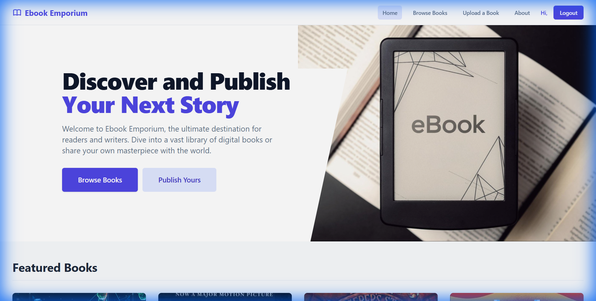
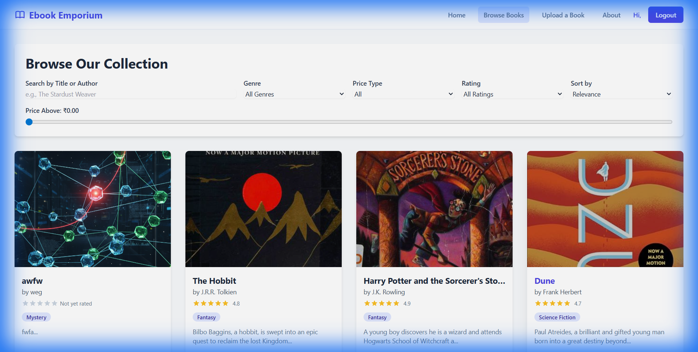
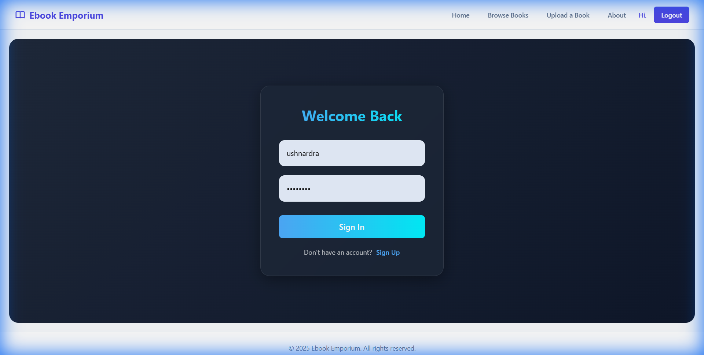

# 📚 Ebook Emporium

> A modern, dynamic web application for browsing, buying, and selling ebooks. Built with React, Vite, and Django.



## 🌟 Overview

**Ebook Emporium** is a feature-rich platform designed for book lovers. It offers a seamless experience for discovering new titles, reading descriptions, and managing a personal library. With a sleek, responsive design and a robust backend, it bridges the gap between readers and their next favorite book.

## � Screenshots

| Browse Collection | Login Page |
|:---:|:---:|
|  |  |

## 🚀 Features

-   **🎨 Modern UI/UX**: A visually stunning interface featuring glassmorphism, smooth animations, and a responsive layout that works perfectly on all devices.
-   **� Extensive Collection**: Browse a curated list of ebooks with detailed metadata, including authors, genres, and ratings.
-   **� Advanced Search**: Quickly find books by title or author.
-   **🔐 Secure Authentication**: Robust user management system with secure sign-up and login capabilities.
-   **📖 Interactive Details**: View comprehensive book details, reviews, and pricing information.
-   **📤 Book Uploads**: Users can upload and list their own ebooks for sale.
-   **⭐ Rating System**: Rate and review books to share your opinion with the community.

## 🛠️ Tech Stack

### Frontend
-   **Framework**: [React](https://react.dev/) (v18+)
-   **Build Tool**: [Vite](https://vitejs.dev/)
-   **Routing**: [React Router](https://reactrouter.com/)
-   **Styling**: Modern Vanilla CSS with CSS Variables & Flexbox/Grid

### Backend
-   **Framework**: [Django](https://www.djangoproject.com/)
-   **API**: Django REST Framework
-   **Database**: SQLite (Development) / PostgreSQL (Production)

## 📂 Project Structure

```
ebook-emporium/
├── assets/           # Static assets (images, icons)
├── backend/          # Django backend application
│   ├── api/          # API endpoints and logic
│   ├── media/        # User-uploaded content (book covers, PDFs)
│   └── ...
├── components/       # Reusable React components
├── context/          # Global state management (Auth, Books)
├── pages/            # Application views (Home, Browse, Login, etc.)
├── App.jsx           # Main frontend entry point
└── README.md         # Project documentation
```

## ⚡ Getting Started

Follow these steps to set up the project locally.

### Prerequisites

-   **Node.js** (v16 or higher)
-   **Python** (v3.8 or higher)
-   **pip** (Python package manager)

### Installation

1.  **Clone the repository**
    ```bash
    git clone https://github.com/yourusername/ebook-emporium.git
    cd ebook-emporium
    ```

2.  **Frontend Setup**
    ```bash
    # Install dependencies
    npm install

    # Start the development server
    npm run dev
    ```

3.  **Backend Setup** (Open a new terminal)
    ```bash
    cd backend
    
    # Create a virtual environment (optional but recommended)
    python -m venv venv
    # Activate: .\venv\Scripts\activate (Windows) or source venv/bin/activate (Mac/Linux)

    # Install dependencies
    pip install -r requirements.txt

    # Run migrations
    python manage.py migrate

    # Start the server
    python manage.py runserver
    ```

4.  **Access the App**
    -   Frontend: `http://localhost:5173`
    -   Backend API: `http://localhost:8000`

## 🤝 Contributing

Contributions are welcome! Please feel free to submit a Pull Request.

1.  Fork the project
2.  Create your feature branch (`git checkout -b feature/AmazingFeature`)
3.  Commit your changes (`git commit -m 'Add some AmazingFeature'`)
4.  Push to the branch (`git push origin feature/AmazingFeature`)
5.  Open a Pull Request

## 📄 License

This project is open source and available under the [MIT License](LICENSE).
